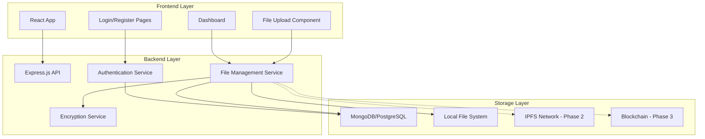

# Design Document: Blockchain and IPFS File Manager

## Overview

The Blockchain and IPFS File Manager is a decentralized file storage system that combines traditional web technologies with blockchain and IPFS for secure, distributed file management. The system provides AES encryption, user authentication, and a phased approach to implementing decentralized storage.

The architecture follows a layered approach:
- **Phase 1**: Core functionality with React frontend, Node.js backend, traditional database, and AES encryption
- **Phase 2**: IPFS integration for decentralized file storage
- **Phase 3**: Blockchain integration for file metadata and ownership tracking

## Architecture



## Components and Interfaces

### Frontend Components

#### Authentication Components
- **LoginPage**: User login form with email/password validation
- **RegisterPage**: User registration form with input validation
- **AuthContext**: React context for managing authentication state

#### Dashboard Components
- **Dashboard**: Main interface displaying file list and upload functionality
- **FileUpload**: Drag-and-drop file upload component with progress tracking
- **FileList**: Display user's files with download/delete actions
- **FileItem**: Individual file display with metadata and actions

#### Core Interfaces
```typescript
interface User {
  id: string;
  email: string;
  createdAt: Date;
}

interface FileMetadata {
  id: string;
  userId: string;
  originalName: string;
  encryptedName: string;
  size: number;
  mimeType: string;
  uploadDate: Date;
  encryptionKey: string;
  ipfsHash?: string; // Phase 2
  blockchainTxHash?: string; // Phase 3
}

interface UploadProgress {
  fileId: string;
  progress: number;
  status: 'uploading' | 'encrypting' | 'storing' | 'complete' | 'error';
}
```

### Backend Services

#### Authentication Service
- JWT-based authentication
- Password hashing using bcrypt
- Session management
- User registration and login endpoints

#### File Management Service
- File upload handling with multipart/form-data
- File metadata management
- File retrieval and download
- File deletion with cleanup

#### Encryption Service
- AES-256-GCM encryption for file contents
- Unique key generation per file using crypto.randomBytes
- Secure key storage with user association
- Encryption/decryption utilities

```javascript
// Encryption Service Interface
class EncryptionService {
  async encryptFile(fileBuffer, userId) {
    // Generate unique key and IV
    // Encrypt file content
    // Return encrypted data and metadata
  }
  
  async decryptFile(encryptedData, key, iv) {
    // Decrypt file content
    // Return original file buffer
  }
}
```

## Data Models

### Database Schema

#### Users Table
```sql
CREATE TABLE users (
  id UUID PRIMARY KEY DEFAULT gen_random_uuid(),
  email VARCHAR(255) UNIQUE NOT NULL,
  password_hash VARCHAR(255) NOT NULL,
  created_at TIMESTAMP DEFAULT CURRENT_TIMESTAMP,
  updated_at TIMESTAMP DEFAULT CURRENT_TIMESTAMP
);
```

#### Files Table
```sql
CREATE TABLE files (
  id UUID PRIMARY KEY DEFAULT gen_random_uuid(),
  user_id UUID REFERENCES users(id) ON DELETE CASCADE,
  original_name VARCHAR(255) NOT NULL,
  encrypted_name VARCHAR(255) NOT NULL,
  file_size BIGINT NOT NULL,
  mime_type VARCHAR(100),
  encryption_key TEXT NOT NULL,
  encryption_iv TEXT NOT NULL,
  upload_date TIMESTAMP DEFAULT CURRENT_TIMESTAMP,
  ipfs_hash VARCHAR(255), -- Phase 2
  blockchain_tx_hash VARCHAR(255), -- Phase 3
  status VARCHAR(50) DEFAULT 'active'
);
```

### File Storage Structure
```
uploads/
├── encrypted/
│   ├── user_id/
│   │   ├── file_id_1.enc
│   │   ├── file_id_2.enc
│   │   └── ...
└── temp/
    ├── upload_session_1/
    └── upload_session_2/
```

## Correctness Properties

*A property is a characteristic or behavior that should hold true across all valid executions of a system-essentially, a formal statement about what the system should do. Properties serve as the bridge between human-readable specifications and machine-verifiable correctness guarantees.*

Let me analyze the acceptance criteria to determine which ones can be tested as properties:

### Property Reflection

After reviewing all properties identified in the prework, I can consolidate some redundant properties:

- Properties 3.1 and 3.2 can be combined into a single round-trip encryption property
- Properties 4.1 and 4.2 can be combined into a comprehensive data persistence property
- Properties 5.1 and 5.2 can be combined into an IPFS round-trip property
- Properties 7.2, 7.3, and 7.4 can be combined into a comprehensive UI feedback property

### Correctness Properties

**Property 1: Authentication round-trip**
*For any* valid user credentials, successful registration followed by login with those credentials should grant dashboard access
**Validates: Requirements 1.1, 1.2**

**Property 2: Invalid credential rejection**
*For any* invalid credential combination, authentication attempts should be rejected with appropriate error messages
**Validates: Requirements 1.3**

**Property 3: Session management consistency**
*For any* authenticated user session, the session should remain valid until expiration or logout
**Validates: Requirements 1.4**

**Property 4: File upload validation**
*For any* file within system constraints, the upload process should accept the file and provide progress feedback
**Validates: Requirements 2.1, 2.2**

**Property 5: Upload error handling**
*For any* failed upload attempt, the system should display error messages and allow retry
**Validates: Requirements 2.3**

**Property 6: File list display consistency**
*For any* user's file collection, the dashboard should display all files with complete metadata
**Validates: Requirements 2.4**

**Property 7: Encryption round-trip**
*For any* uploaded file, encrypting then decrypting should produce the original file content
**Validates: Requirements 3.1, 3.2**

**Property 8: Encryption key uniqueness**
*For any* two different files, their encryption keys should be unique
**Validates: Requirements 3.3**

**Property 9: Secure key storage**
*For any* encryption key, it should only be accessible to the authorized file owner
**Validates: Requirements 3.4**

**Property 10: Database persistence consistency**
*For any* user registration or file upload, the corresponding data should be persistently stored in the database
**Validates: Requirements 4.1, 4.2**

**Property 11: User-file relationship integrity**
*For any* file query, only files belonging to the authenticated user should be returned
**Validates: Requirements 4.3, 4.4**

**Property 12: IPFS storage round-trip**
*For any* encrypted file stored on IPFS, retrieving it by hash should return the identical encrypted content
**Validates: Requirements 5.1, 5.2**

**Property 13: IPFS hash uniqueness**
*For any* two different file contents, their IPFS hashes should be unique
**Validates: Requirements 5.3**

**Property 14: File-hash mapping consistency**
*For any* file stored on IPFS, the system should maintain accurate mapping between file ID and IPFS hash
**Validates: Requirements 5.4**

**Property 15: Blockchain metadata recording**
*For any* file upload, the blockchain should record complete metadata and ownership information
**Validates: Requirements 6.1**

**Property 16: Ownership verification**
*For any* ownership query, the blockchain should return verifiable and accurate ownership records
**Validates: Requirements 6.2**

**Property 17: Blockchain immutability**
*For any* recorded file operation, the blockchain history should remain immutable and verifiable
**Validates: Requirements 6.3**

**Property 18: File integrity verification**
*For any* file on the blockchain, hash comparison should enable integrity verification
**Validates: Requirements 6.4**

**Property 19: Dashboard UI feedback**
*For any* system operation, the dashboard should provide real-time progress and status updates
**Validates: Requirements 7.2, 7.3, 7.4**

## Error Handling

### Authentication Errors
- Invalid credentials: Return 401 with descriptive message
- Expired sessions: Return 401 and redirect to login
- Registration conflicts: Return 409 for duplicate emails
- Validation errors: Return 400 with field-specific messages

### File Upload Errors
- File size exceeded: Return 413 with size limit information
- Invalid file type: Return 415 with supported types list
- Storage failures: Return 500 with retry instructions
- Encryption failures: Return 500 and cleanup partial uploads

### Database Errors
- Connection failures: Implement retry logic with exponential backoff
- Constraint violations: Return 409 with conflict details
- Query timeouts: Return 504 with retry suggestions
- Data corruption: Log errors and return 500

### IPFS Integration Errors (Phase 2)
- Network unavailable: Fallback to local storage with sync later
- Upload failures: Retry with exponential backoff
- Hash verification failures: Re-upload and verify
- Gateway timeouts: Use alternative gateways

### Blockchain Integration Errors (Phase 3)
- Network congestion: Queue transactions for later processing
- Gas estimation failures: Use fallback gas limits
- Transaction failures: Retry with higher gas prices
- Smart contract errors: Log and notify administrators

## Testing Strategy

### Dual Testing Approach
The system will use both unit testing and property-based testing for comprehensive coverage:

**Unit Tests**: Focus on specific examples, edge cases, and integration points
- Authentication flows with specific credential combinations
- File upload with known file types and sizes
- Database operations with sample data
- Error conditions with controlled failure scenarios

**Property-Based Tests**: Verify universal properties across all inputs
- Generate random user credentials for authentication testing
- Create various file types and sizes for upload testing
- Test encryption/decryption with random file contents
- Verify database operations with generated data sets

### Property-Based Testing Configuration
- **Framework**: Use `fast-check` for JavaScript/TypeScript property-based testing
- **Test Iterations**: Minimum 100 iterations per property test
- **Test Tagging**: Each property test tagged with format: **Feature: blockchain-ipfs-file-manager, Property {number}: {property_text}**

### Testing Libraries and Tools
- **Frontend**: Jest + React Testing Library for component testing
- **Backend**: Jest + Supertest for API testing
- **Property Testing**: fast-check for property-based tests
- **Database**: In-memory database for testing isolation
- **Mocking**: Minimal mocking - prefer real implementations where possible

### Test Organization
```
tests/
├── unit/
│   ├── auth/
│   ├── files/
│   ├── encryption/
│   └── database/
├── integration/
│   ├── api/
│   └── e2e/
└── properties/
    ├── auth.properties.test.js
    ├── files.properties.test.js
    ├── encryption.properties.test.js
    └── database.properties.test.js
```

### Performance Testing
- File upload performance with various sizes (1MB to 100MB)
- Concurrent user authentication load testing
- Database query performance with large datasets
- Encryption/decryption performance benchmarks

### Security Testing
- SQL injection prevention testing
- XSS vulnerability scanning
- Authentication bypass attempts
- File access control verification
- Encryption key security validation